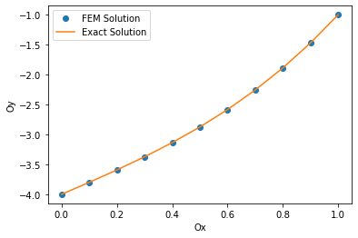

# 1D Elliptic Problem 

This assignment illustrates how to solve the 1D Elliptic equation
by using Finite Element Method (FEM). This is the simple FEM code 
written by Python. 

## Authors

- [Le Dinh Tan](https://github.com/ledinhtan)

## Problem

Finding u = u(x), x \in (0,1) satisfies
        -u"(x) + f = 0, x \in (0,1). 

Boundary condition: 
- u(1) = g,
- -u'(0) = h,
where f is a given function, g, and h are real given numbers.

## Numerical Results

Running the code to see the numerical results.

When f = -6x, g = -1, and h = -2, the following table illustrates 
the numerical results compared with the exact solution:

| Node | Approximate |      Exact     |
| :--  | :---------- | :------------- |
|  1   |   -4.000    |     -4.000     |
|  2   |   -3.799    |     -3.799     |
|  3   |   -3.592    |     -3.592     |
|  4   |   -3.373    |     -3.373     |
|  5   |   -3.136    |     -3.136     |
|  6   |   -2.875    |     -2.875     |
|  7   |   -2.584    |     -2.584     |
|  8   |   -2.257    |     -2.257     |
|  9   |   -1.888    |     -1.888     |
|  10  |   -1.471    |     -1.471     |
|  11  |   -1.000    |     -1.000     |

## Programming Language

**Programming language:** Python

**Version:** 3.9.7